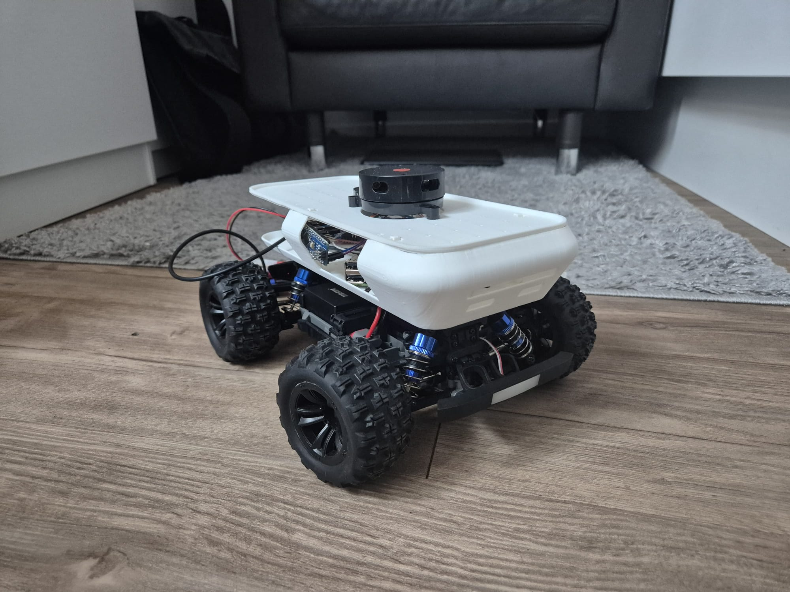
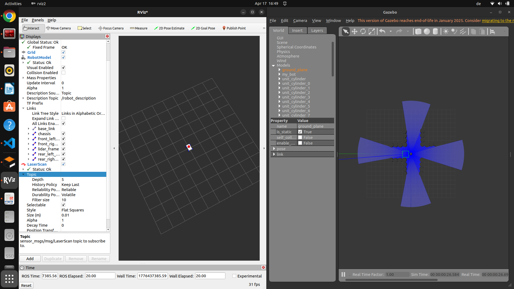
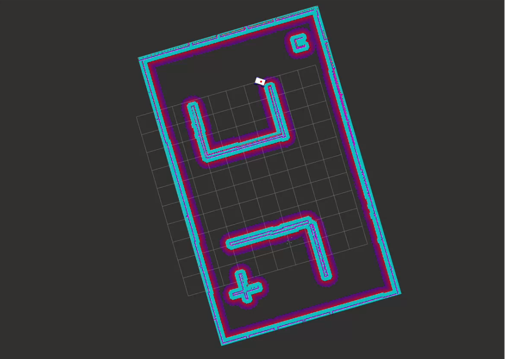

## Thesis Project

This project implements an autonomous RC car using ROS 2 (Humble), combining simulation, perception, and navigation into a complete robotic system. The vehicle is modeled with an Ackermann steering system and equipped with a LiDAR sensor for environment perception.

The system is simulated in Gazebo, where realistic physics and sensor data are generated, and visualized in RViz for real-time monitoring of LiDAR data, TF frames, and mapping results. Using SLAM Toolbox, the robot builds a 2D map of its environment while estimating its position.

The project demonstrates a full autonomous robotics pipeline:

Simulation → LiDAR Perception → SLAM → Mapping → Navigation (Nav2)

This work serves as a foundation for scalable autonomous driving systems and showcases the integration of robotics and AI techniques in a controlled environment.

## Important ##

Remember that you need to add the visualizations inside rviz, such as robot description, laser, map.

## Gazebo Environment

ros2 launch maqui_na launch.sim.launch.py world:=../src/maqui_na/worlds/maqui_na_saved.world

By writting this code in the terminal, you will be able bridge Gazebo and Ros2. Keep in mind that you will have to open rviz separately. You must add the robot description in order to see the URDF of the robot.

ros2 run joint_state_publisher_gui joint_state_publisher_gui

Will be need it to visualize the TF of the robot.

## SLAM Visualization

The list below contains the commands used to visualize the SLAM algorithm:

**New Slam Map**

ros2 launch slam_toolbox online_async_launch.py params_file:=./src/maqui_na/config/mapper_params_online_async.yaml use_sim_time:=true

**Saved Slam Map**

ros2 launch slam_toolbox localization_launch.py \ slam_params_file:=/home/angello/thesis/src/maqui_na/config/mapper_params_online_async.yaml \ use_sim_time:=true

ros2 launch slam_toolbox localization_launch.py \ "slam_params_file:=/home/angello/thesis/src/maqui_na/config/mapper_params_online_async.yaml" \ "use_sim_time:=true"

**Running Nav2**

ros2 run nav2_map_server map_server --ros-args -p yaml_filename:=maqui_na_save.yaml -p use_sim_time:=true

**Activation of The Saved Map**

ros2 run nav2_util lifecycle_bringup map_server

**Activate AMCL**

ros2 run nav2_amcl amcl --ros-args -p use_sim_time:=true

**To Activate AMCL, afterwards 2D position arrow estimation.**

ros2 run nav2_util lifecycle_bringup amcl

**Twist Mux**

ros2 run twist_mux twist_mux --ros-args --params-file ./src/maqui_na/config/twist.mux.yaml -r cmd_vel_out:=diff_cont/cmd_vel_unstamped

**Nav2 Navigation Launch**

ros2 launch nav2_bringup navigation_launch.py use_sim_time:=true

